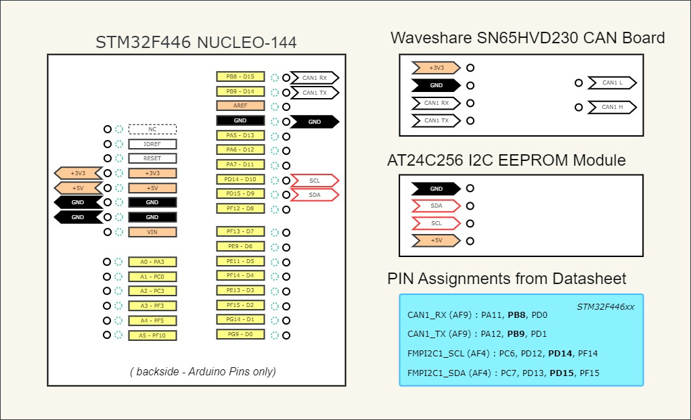

# Repository Structure

```
+- cmake        : submodule referencing the repository 'cmake-scripts'
+- debug        : debugger configurations
+- dependencies : external managed components
+- src          : canopen example project
|  +- app       : application source code
|  +- config    : configuration of startup and HAL
|  +- driver    : canopen target specific drivers
```

# CANopen Demo for STM32F4xx Microcontrollers

This project demonstrates the usage of the free [CANopen Stack Project](https://canopen-stack.org). The included application is the Quickstart - "*CANopen clock application*", described in detail at the [project website](https://canopen-stack.org/latest/start/quickstart/).

We use the [STM32Cube MCU Full Package for the STM32F4 series](https://github.com/STMicroelectronics/STM32CubeF4) made by ST Microelectronics as the low-level foundation for the chip configuration, the startup, and the driver implementation. With some slight enhancements to match our CMake build environment, we provide a small source code package out of a [forked repository](https://github.com/embedded-office/STM32CubeF4) for integration in our demo projects.

My hardware setup for this development and testing is:
- the [Nucleo-144 STM32F446](https://www.st.com/en/evaluation-tools/nucleo-f446ze.html)
- a CAN tranceiver [Waveshare SN65HVD230 CAN Board](https://www.waveshare.com/sn65hvd230-can-board.htm)
- an Atmel [AT24C256 I2C EEPROM](https://www.microchip.com/en-us/product/AT24C256C)
- the [KVaser USBcan II HS/HS](https://www.kvaser.com/product/kvaser-usbcan-ii-hshs/) for CAN bus monitoring
- the [Saleae Logic Analyzer](https://www.saleae.com/) for low level measurements

The wiring is pretty simple. For your reference, see the essence in a small diagram:



For details, check:
- the [User Manual for STM32 Nucleo-144 boards](https://www.st.com/resource/en/user_manual/um1974-stm32-nucleo144-boards-mb1137-stmicroelectronics.pdf)
- the [STM32F446xx Datasheet](https://www.st.com/resource/en/datasheet/stm32f446re.pdf)
- the [Reference Manual for STM32446xx MCUs](https://www.st.com/resource/en/reference_manual/dm00135183-stm32f446xx-advanced-arm-based-32-bit-mcus-stmicroelectronics.pdf)

## Usage

### Development Tools

Download and install these free tools for your system:

- Install the build tools [Cmake](https://cmake.org/)
- Install the build system [Ninja](https://ninja-build.org/)
- Install the cross-compiler [Arm GNU Toolchain](https://developer.arm.com/Tools%20and%20Software/GNU%20Toolchain)

*Note: on my Windows machine, I use the [Ozone debugger](https://www.segger.com/downloads/jlink/) with the free [ST-Link Reflash Utility](https://www.segger.com/products/debug-probes/j-link/models/other-j-links/st-link-on-board/) from Segger. The generated debug information in the ELF image should be suitable for all other debuggers, too.*


### Submodule: cmake-scripts

The basic collection of re-usable CMake scripts are placed as a Git submodule in the directory `/cmake`. The Git submodule is a reference to a specific commit hash of the Git repository [cmake-scripts](https://github.com/embedded-office/cmake-scripts).

*Small reminder: when cloning this repository you need to initialize and update the submodules:*

```bash
# clone Git repository and initialize submodules:
$ git clone --recurse-submodules <repository>

# or, in case you have already cloned the Git repository:
$ git clone <repository>
$ cd <repository-directory>
$ git submodule update --init
```


### Project dependencies

We use two extern managed components to build our target application. When using external projects it is important to define naming rules for exported CMake `target` names to eliminate name collisions.

For the example application in this repository we use:

- Target [stm32f4xx-hal](https://github.com/embedded-office/STM32CubeF4) - a fork of the STM32CubeF4 package with enhancements for usage with CMake
- Target [canopen-stack](https://github.com/embedded-office/canopen-stack) - the free CANopen Stack, provided by Embedded Office

*Note: The used versions of the dependencies are defined in the directory `/dependencies`.*


## Build instructions

Just type in the project root directory:

```bash
# configure the project for debugging
$ cmake --preset debug

# build the application for your target
$ cmake --build ./build/debug
```

The target image file `canopen-stm32f4xx.elf` and the corresponding map file `canopen-stm32f4xx.map` are generated and placed in `out/debug`.


## Load and Executing on target

For the Ozone debugger there is a basic debugger configuration `debug/ozone.jdebug`, which loads the image to the target and runs to function `main()`.

- power up your STM32F446 nucleo board
- double-click the debugger configuration
- watch the uploading and running to main ...

... and have fun playing with this tiny CANopen quickstart application :)

If you encounter any improvement in descriptions, project setup, build system, implementation or documentation, please rise an issue and help me to simplify the life of Embedded software engineers.
